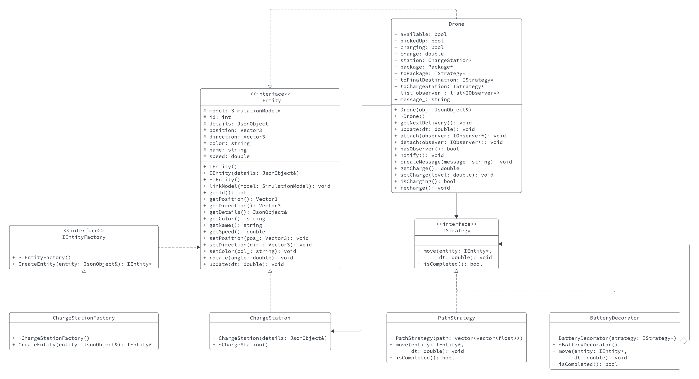

## Drone Simulation System Overview
This program simulates the delivery of a package via a flying drone from a starting destination to an end customer/robot. This takes place within a 3D representation of the University of Minnesota campus. Deliveries can be scheduled online by the user with their choice of name and search strategy. This delivery can then be viewed in real-time on the campus map — as well as any other deliveries/entities. 

## Running the Simulation
### Running Locally

Go to the project directory
```bash
cd /path/to/repo/project
```
Build the project
```bash
make -j
```
Run the project (./build/web-app <port> <web folder>)
```bash
./build/bin/transit_service 8081 apps/transit_service/web/
```
Navigate to http://127.0.0.1:8081 and you should see a visualization. 

Navigate to http://127.0.0.1:8081/schedule.html and you should see a page to schedule the trips.

### Running with Docker

Sign into DockerHub and navigate to <https://hub.docker.com/repository/docker/evanrichards0n/drone_sim/general>

Pull the image and run the project
```bash
docker run --rm -it -p 8081:8081 evanrichards0n/drone_sim
```

Navigate to http://127.0.0.1:8081 and you should see a visualization.

Navigate to http://127.0.0.1:8081/schedule.html and you should see a page to schedule the trips.

## Simulation Functionality
The simulation operates through several core code files, notably the 'transit_service,' which houses processes responsible for communicating with the web page and presenting users with a site to access the program's features. Entity movement, creation (including drones, robots, packages, and charging stations), and routing are managed within the 'transit' and 'routing' subfolders. Additionally, the user's choice of routing strategy and algorithm is referenced in this section. The collective integration of these components forms a cohesive and functional drone simulation model.

## New Features
### Drone Battery & Charge Stations - _Decorator & Factory_
This feature introduces a battery to all drones, employing the decorator pattern to seamlessly wrap the battery around each drone with additional attributes such as capacity and discharge rate. The drone autonomously tracks its current battery status and, when necessary, travels to factory-created recharging stations. This addition brings a realistic element to the simulation, mirroring a potential real-life application where recharging/refueling is a relevant consideration.

The decorator pattern was chosen for the battery design, offering a simple addition to an existing object—the drone. This implementation adheres to the Single Responsibility and Open-Closed Principles of SOLID, enhancing functionality in a flexible and reusable manner.

Similarly, the factory pattern was utilized for creating charge stations, providing an interface for generating the newly required objects.

This new feature is not directly user-interactable, as all newly created drones are equipped with a battery by default. Likewise, charge stations are created during the application startup process.



### Notifications - _Observer_
This features adds notifications to the sidebar of the 3D simulation.

This feature is valuable because it provides insight on the simulation in a purely text based format. This avenue is important and has its uses in a number of ways:

- Notifications promote the accessibility of the simulation. It is far easier to read the sidebar rather than list through every single entity in the simulation using the dropdown
- Notifications can later be implemented into a system to notify clients as to the status of their package.
- Notifications can offer very helpful insight into what happened to entities should something go wrong.

I used the observer pattern to implement this feature. This was an obvious choice since I needed to track the status of a variety of objects without breaking the S of SOLID. Drones should not be responsible for sending messages to the controller and printing them on the html web page, so it was necessary to make a mediator class that can recieve and track the Drone class for any new messages and pass them to the simulation. 

I also chose the Observer design pattern because it was useful to have a way for the client, in this case the SimulationModel to "unsubscribe" from recieving notifications, and this can be facilitated by detaching the observer from the class it is tracking. 

For the subclass observers it was necessary to define an abstract IObserver class. This was done to maintain the O of SOLID since, in this extension I only tracked Drones, but if you wanted to extend the observer functionality to other entities, it would be very easy to do so by creating another class to track this Entity that implements IObserver. 

This feature is automatically made available to users. Drone notifications are shown in the left sidebar.

In a real-world application, the inclusion of notifications would be highly beneficial and appreciated by customers and drone operators alike. These messages serve as crucial insights into the drone's operational status and provide a referencible log of drone activities.


## Docker
The following link contains the docker image of this program which can be obtained and ran by referring to the previous _**Running with Docker**_ section: https://hub.docker.com/repository/docker/evanrichards0n/drone_sim/general
